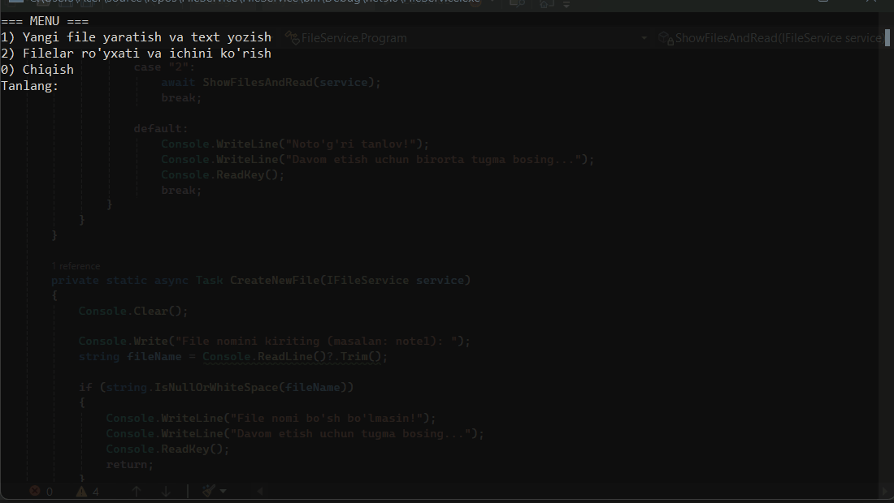

# FileService (Console App)

Oddiy C# console dastur. Dastur `.txt` fayllar bilan ishlaydi:
- yangi fayl yaratib matn yozadi
- mavjud fayllar ro‘yxatini ko‘rsatadi
- tanlangan fayl ichidagi matnni o‘qib beradi
  

## Funksiyalar
- **1-menyu:** Fayl nomini so‘raydi va matn yozib saqlaydi  
  - agar fayl allaqachon mavjud bo‘lsa: xabar beradi
- **2-menyu:** Papkadagi barcha `.txt` fayllarni ko‘rsatadi (`M: File.txt` formatda)  
  - tanlangan fayl ichidagi matnni chiqaradi
- Console har safar menyuda tozalanadi
- O‘qilganda matn ekranda turadi, tugma bosilgach menyuga qaytadi

## Saqlash joyi
Fayllar quyidagi papkaga saqlanadi:
- `D:\C#Work`

Agar papka mavjud bo‘lmasa, dastur avtomatik yaratadi.

## Ishga tushirish
1. Visual Studio orqali projectni oching
2. `Program.cs` ni ishga tushiring (Start)

## Talablar
- .NET (Visual Studio bilan)

## Muallif
Ro'ziyev Eldor
